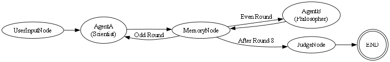

# Multi-Agent Debate DAG using LangGraph

This project simulates a structured debate between two AI agents using a LangGraph DAG. It includes turn control, memory summarization, logical progression validation, and a judging system that declares a winner.

## 🧠 Roles
- **AgentA**: Scientist
- **AgentB**: Philosopher
- **Judge**: An LLM-based evaluator that reviews all arguments and gives a final verdict

## 📦 Features
- CLI-based debate starter
- 8 total debate rounds (4 per agent, alternating)
- Each agent gets filtered memory (no full sharing)
- Judging logic includes natural language and structured verdict
- All outputs logged in `log.txt`
- DAG graph generation supported

---

## 🔧 Setup

### 1. Clone the Repo
```bash
git clone <your-repo>
cd multi_agent_debate
````

### 2. Install Dependencies

```bash
pip install -r requirements.txt
```

### 3. Set Your API Key

Create a `.env` file or set it in terminal:

```
GROQ_API_KEY=your-groq-key-here
```

Or in PowerShell:

```powershell
$env:GROQ_API_KEY = "your-key"
```

---

## 🚀 Running the Debate

```bash
python main.py
```

You’ll be prompted to enter a debate topic:

```
Enter topic for debate: Should AI be regulated like medicine?
```

---

## 🧩 DAG Diagram

The following illustrates the debate flow between the user, agents, memory, and judge:



---

## 📁 Folder Structure

```
.
├── main.py
├── logger.py
├── prompts.py
├── dag_diagram.png
├── log.txt
└── nodes/
    ├── agent_node.py
    ├── user_input_node.py
    ├── memory_node.py
    └── judge_node.py
```

---

## 📜 Output Format

```text
[Scientist] Mars offers redundancy for human survival...
[Philosopher] Earth is our moral responsibility...

[Judge] Debate Summary:
Winner: Philosopher
Reason: Grounded ethical reasoning with holistic perspective.
```

---

## 👨‍💻 Author

Made as part of the ATG Internship Assignment — Multi-Agent LangGraph Challenge.
